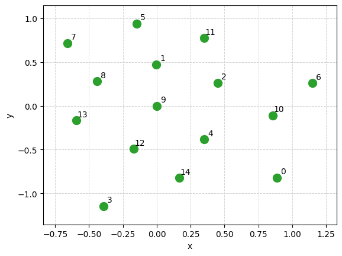
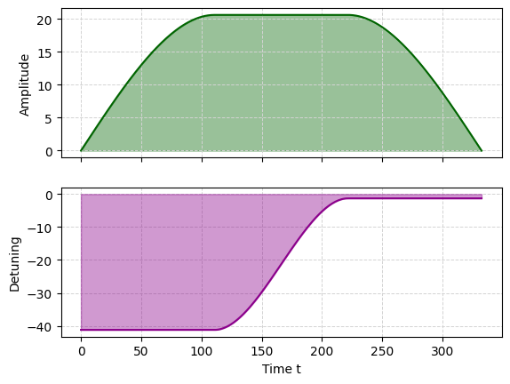
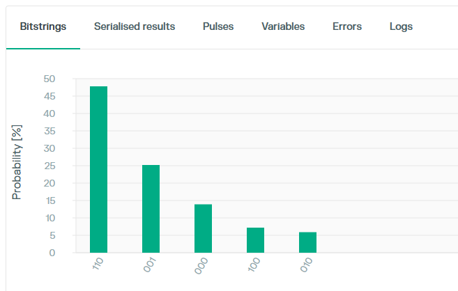

!!! danger "🔥 Can't wait to try it? 🔥"
    Jump straight to the [30-Second Quickstart](get_started/quickstart.md).

# Qubo Solver

**Qubo Solver** is a Python library for solving **Quadratic Unconstrained Binary Optimization (QUBO)** problems on Pasqal's neutral-atom quantum processors.

A QUBO instance is defined by a **symmetric matrix $Q$** of size $n \times n$. Solving it means finding the binary vector $x$ of length $n$ below — a form general enough to express many combinatorial optimization problems, from finance to machine learning.

$$\min_{x \in \{0,1\}^n} \; x^\top Q x = \sum_{i,j} q_{ij} x_i x_j$$

Qubo Solver implements algorithms to solve QUBO instances: **quantum**, **classical**, and **hybrid quantum-classical**.

To be solved on a neutral-atom quantum processor, a QUBO is embedded onto a **neutral-atom register**, driven with a **laser pulse** designed to steer the atoms toward low-cost bitstrings, and the resulting program is executed and sampled on a QPU or emulator, all behind a **simple** and **flexible** interface.

$$Q = \begin{pmatrix} q_{11} & \cdots & q_{1n} \\ \vdots & \ddots & \vdots \\ q_{n1} & \cdots & q_{nn} \end{pmatrix}$$

⭩ &nbsp;&nbsp;&nbsp;&nbsp;&nbsp;&nbsp;&nbsp;&nbsp;&nbsp;&nbsp; ⭨

<table style="border:none;">
<tr>
<td align="center" style="border:none;"> Register</td>
<td align="center" style="border:none;"> Drive</td>
</tr>
</table>

⭨ &nbsp;&nbsp;&nbsp;&nbsp;&nbsp;&nbsp;&nbsp;&nbsp;&nbsp;&nbsp; ⭩

<table style="border:none;">
<tr>
<td align="center" style="border:none;"></td>
<td align="left" style="border:none;">

<pre style="font-size: 1.0em; text-align:left;">
   labels       bitstrings       costs  counts  probs
0       0  100101100000010 -205.649830       1  0.001
1       0  100000100000010 -199.302937       2  0.002
2       0  100000110000010 -178.590227       1  0.001
3       0  100001100000000 -177.514687       2  0.002
4       0  100000100001000 -175.325455       2  0.002
5       0  100000000001010 -169.498798       3  0.003
6       0  100100100000010 -167.246616       1  0.001
9       0  100000010001010 -148.786089       1  0.001
10      0  100100110000010 -146.533907       1  0.001
11      0  100101100000000 -145.458366       2  0.002
12      0  100000110000000 -140.964319       5  0.005
13      0  100101000000010 -139.631710       2  0.002
14      0  100000100000000 -139.111473      17  0.017
</pre>

</td>
</tr>
</table>

With Qubo Solver you can:

- define QUBO instances from symmetric matrices,
- solve them with classical, quantum, or hybrid solvers, on a QPU or an emulator,
- pre- and post-process instances and solutions to improve solving quality.

Qubo Solver is designed for both **newcomers to quantum computing**, who can implement and run a solver in a few simple steps, and **experienced users**, who will find a flexible environment for exploring new solving methods while interacting with a simple, intuitive QPU interface.

## Where to start

<!-- TODO: revisit this section once the docs are more complete -->

- [30-Second Quickstart](get_started/quickstart.md) — install the library and run your first quantum solver.
- [User guide](user_guide/intro.md) — QUBO instances, solving, and backends.
- [Tutorials](tutorials/01-qubosolver-basics.ipynb) — a guided tour of QUBO.
- [Tutorials in full](tutorials/02-qubosolver-in-full.ipynb) — a deeper dive into QUBO.
